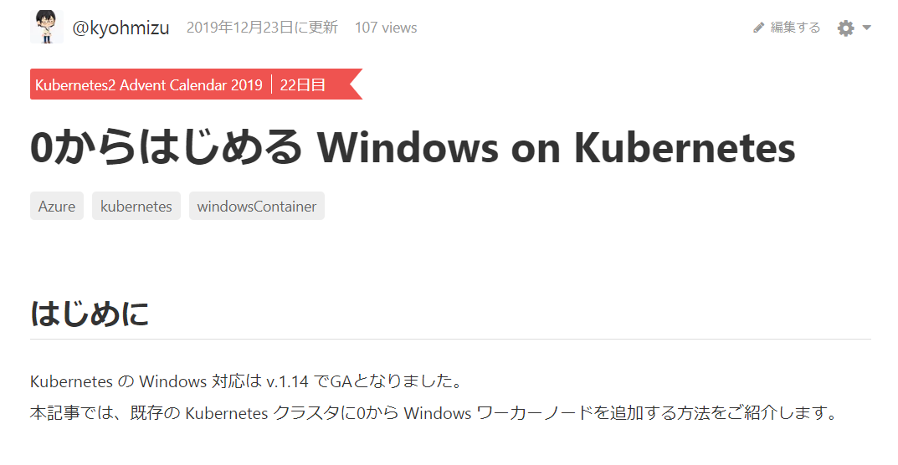

class: center, middle, blue
### Kubernetes に Windows ノードを 0から追加するのは大変だった話

---
### whoami

.left-small[
    
]

.right-large[
- Kyohei Mizumoto(@kyohmizu)

- C# Software Engineer

- Interests
    - Docker
    - Kubernetes
    - Golang
]
---
### アドベントカレンダーに投稿しました

.zoom0[
<u><https://qiita.com/kyohmizu/items/dffdd49123b1e47c3ac4></u>
]

---
### 今日話すこと

- Windows on Kubernetes

- クラスタに0から Windowsノードを追加してみる

- ハマったポイント

---
class: center, middle, blue
### Windows on Kubernetes

---
### Windows on Kubernetes

- Kubernetes V1.14 でGA

---
### 導入方法

.zoom2[
.tmp[
- マネージドサービスを利用する
  - AKS の Windowsノードプール
]

.tmp[
- kubeadm + flannel を使用したノードの追加
  - kubernetes.io で紹介
]

.tmp[
- Microsoft SDN の Kubernetes サポート  
  - flannel を使用
  - wincni を使用
]
]

---
class: center, middle, blue
### クラスタに0から Windowsノードを追加してみる

---
### クラスタの準備

---
### ノード追加の手順

---
class: center, middle, blue
### ハマったポイント

---
### ハマったポイント①

---
### 参考

.zoom2[

]

---
class: center, middle, blue
## Thank you!
