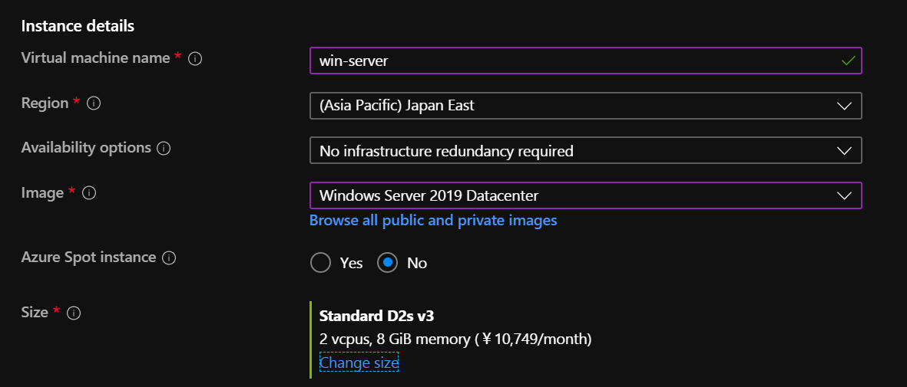
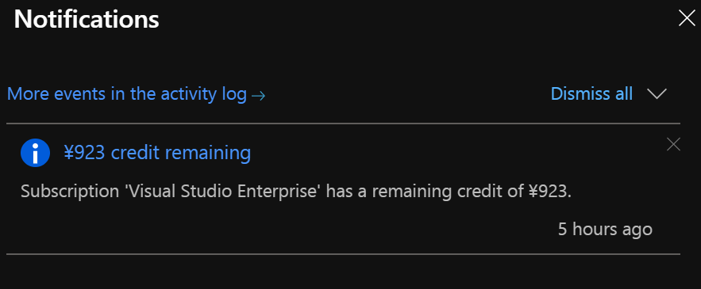

class: center, middle, blue
## Kubernetes に Windowsノードを<br/>0から追加してみた話

---
### whoami

.left-small[
    
]

.right-large[
.tmp[
- Kyohei Mizumoto(@kyohmizu)
]

.tmp[
- C# Software Engineer
]

.tmp[
- Interests
  - Cloud Native
  - Docker
  - Kubernetes
  - Golang
  - Azure
]
]

---
### アドベントカレンダーに投稿しました

.zoom0[
<u><https://qiita.com/kyohmizu/items/dffdd49123b1e47c3ac4></u>
]

<center></center>

---
### モチベーション

.zoom1[
.tmp[
- アドカレの準備大変でした
  - ネットワークの知識不足
  - 勢いよく減っていくAzureクレジット
  - 手順通りに実行しても発生するエラーの数々
  - 直前の方針転換と検証のやり直し
- ギリギリ (3時間遅れ) で投稿！
]

　　　　　↓↓↓

- 得られた知見の共有
- もし詳しい方がいたら話を聞きたい
]

---
### 今日話すこと

- Windows on Kubernetes

- Windowsノード追加の手順

- トラブルシュート

- まとめ

---
class: center, middle, blue
## Windows on Kubernetes

---
### Windows on Kubernetes

.zoom1[

- Kubernetes V1.14 でGA
- クラスタにノードを追加するだけで利用可能
- 対応されたのはワーカーノードのみ
- 未対応の機能もある
  - TerminationGracePeriod や Privileged Containers など
- コンテナネットワークには CNIプラグインを使用
  - kubenet は使用できない
- Windowsコンテナ、Linuxコンテナの適切なスケジューリングが必要

.tmp[
- Windowsコンテナについては以前話をしました
.zoom1[<u><https://speakerdeck.com/kyohmizu/windowskontenaru-men></u>]
]
]

---
class: header-margin
### Windows on Kubernetes

.half-3[
<center></center>
]

.zoom0-r[
<u>https://docs.microsoft.com/en-us/virtualization/windowscontainers/container-networking/architecture</u>
]

---
class: header-margin
### Windows on Kubernetes

.half-3[
<center></center>
]

.zoom0-r[
<u>https://docs.microsoft.com/en-us/virtualization/windowscontainers/container-networking/architecture</u>
]

---
### 導入方法

.zoom2[
.tmp[
- マネージドサービスを利用する
  - AKS の Windowsノードプール他
]

.tmp[
- [kubernetes.io](https://kubernetes.io/docs/setup/production-environment/windows/user-guide-windows-nodes/) のガイドに従う
  - kubeadm + flannel vxlan overlay を使用したノードの追加
]

.tmp[
- [Microsoft SDN](https://github.com/microsoft/SDN/tree/master/Kubernetes) の Kubernetes 導入用スクリプトを使用する
  - flannel vxlan overlay (ドキュメントあり)
  - wincni l2bridge (ドキュメントなし)
]
]

---
### 導入方法

.zoom2[
.tmp[
- マネージドサービスを利用する
  - AKS の Windowsノードプール他
]

.tmp[
- [kubernetes.io](https://kubernetes.io/docs/setup/production-environment/windows/user-guide-windows-nodes/) のガイドに従う
  - kubeadm + flannel vxlan overlay を使用したノードの追加
]

.tmp[
- [Microsoft SDN](https://github.com/microsoft/SDN/tree/master/Kubernetes) の Kubernetes 導入用スクリプトを使用する
  - flannel vxlan overlay (ドキュメントあり)
  - <span style="color:red">wincni l2bridge (ドキュメントなし) ←こちらを採用</span>
]
]

---
class: center, middle, blue
## Windowsノード追加の手順

---
### クラスタを準備

.zoom1[
<u><https://github.com/ivanfioravanti/kubernetes-the-hard-way-on-azure></u>

```bash
$ az vm list -d -g kubernetes -o table
Name          ResourceGroup    PowerState    PublicIps       Location
------------  ---------------  ------------  --------------  ----------
controller-0  kubernetes       VM running    XX.XXX.XXX.XXX  japaneast
controller-1  kubernetes       VM running    XX.XXX.XXX.XXX  japaneast
controller-2  kubernetes       VM running    XX.XXX.XXX.XXX  japaneast
worker-0      kubernetes       VM running    XX.XXX.XXX.XXX  japaneast
worker-1      kubernetes       VM running    XX.XXX.XXX.XXX  japaneast
worker-2      kubernetes       VM running    XX.XXX.XXX.XXX  japaneast

$ kubectl get no
NAME       STATUS   ROLES    AGE     VERSION
worker-0   Ready    <none>   12m     v1.15.0
worker-1   Ready    <none>   7m26s   v1.15.0
worker-2   Ready    <none>   5m59s   v1.15.0
```
]

---
class: header-margin
### ノード用 Windows Server VM を準備

<center></center>

.zoom1[
Hyper-V 分離コンテナを使用する場合は VMサイズに注意しましょう
.zoom1[https://docs.microsoft.com/en-us/azure/virtual-machines/windows/nested-virtualization]
]

---
### Windows Server の操作

.zoom1[
.zoom01[
<u><https://docs.microsoft.com/en-us/virtualization/windowscontainers/kubernetes/joining-windows-workers></u>
]

- Docker をインストール

```powershell
Install-Module -Name DockerMsftProvider -Repository PSGallery -Force
Install-Package -Name Docker -ProviderName DockerMsftProvider
Restart-Computer -Force
```

- インフラ用コンテナイメージを取得

```powershell
docker pull mcr.microsoft.com/windows/nanoserver:1809
docker tag mcr.microsoft.com/windows/nanoserver:1809 `
mcr.microsoft.com/windows/nanoserver:latest
```
]

---
### Windows Server の操作

.zoom1[
- kubeconfig と Kubernetes のノード用バイナリを`C:\k`に配置

```powershell
ls config,*exe

  Directory: C:\k

Mode                LastWriteTime         Length Name
----                -------------         ------ ----
-a----       12/22/2019  11:49 AM           6254 config
-a----       12/11/2019   1:14 PM       40086016 kube-proxy.exe
-a----       12/11/2019   1:20 PM       47195136 kubectl.exe
-a----       12/11/2019   1:20 PM      119127552 kubelet.exe
```
]

---
### スクリプトをダウンロード

.zoom01[
<u><https://github.com/microsoft/SDN/blob/master/Kubernetes/windows/start.ps1></u>

```powershell
Start-BitsTransfer `
https://github.com/microsoft/SDN/raw/master/Kubernetes/windows/start.ps1
```
]

.zoom1[
ドキュメントのない wincni 用のスクリプトを採用した理由：

- flannel は事前にクラスタにインストールが必要
- hard way のクラスタは CNIプラグインを使用している
  <u><https://github.com/containernetworking/plugins></u>
  - flannel を使う必要がない
- ちなみに flannel をインストールしても動作します  
  (最初はこちらでやっていて、後で気づきましたorz)
]

---
### スクリプトを実行

.zoom1[
```powershell
.\start.ps1 -masterIp 10.240.0.4 -clusterCIDR 10.200.0.0/16
```

1. 必要なバイナリ、スクリプト、Dockerfile をダウンロード
1. コンテナイメージを作成（InstallImages.ps1）
1. HNS ネットワークを初期化
1. kubelet を起動（start-kubelet.ps1）
1. kube-proxy を起動（start-kubeproxy.ps1）
1. ルーティングテーブルに追加（AddRoutes.ps1）

これだけで Kubernetes にノード追加できるはず！
]

---
### スクリプトを実行

.zoom1[
```powershell
.\start.ps1 -masterIp 10.240.0.4 -clusterCIDR 10.200.0.0/16
```

1. 必要なバイナリ、スクリプト、Dockerfile をダウンロード
1. コンテナイメージを作成（InstallImages.ps1）
1. HNS ネットワークを初期化
1. kubelet を起動（start-kubelet.ps1）
1. kube-proxy を起動（start-kubeproxy.ps1）
1. ルーティングテーブルに追加（AddRoutes.ps1）

~~これだけで Kubernetes にノード追加できるはず！~~  
<span style="color:red">→エラー (この時点でアドカレ当日の午後)</span>
]

---
class: center, middle, blue
## トラブルシュート

---
### ①ノードの podCIDR が未設定

.zoom1[
```bash
# 何も表示されない
$ kubectl get nodes -o jsonpath='{.items[*].spec.podCIDR}'
```

- スクリプト内で podCIDR の一覧を取得できずエラー
- 本来はノード3台の podCIDR が取得できるはず
- kubelet-config.yaml には podCIDR を設定しているが…  
  .zoom01[<u><https://github.com/ivanfioravanti/kubernetes-the-hard-way-on-azure/blob/master/docs/09-bootstrapping-kubernetes-workers.md></u>]

```yaml
kind: KubeletConfiguration
apiVersion: kubelet.config.k8s.io/v1beta1
~
podCIDR: 10.200.0.0/24
```
]

---
### ①ノードの podCIDR が未設定

.zoom1[
- 原因は kube-controller-manager のオプション設定漏れ
- kube-controller-manager.service を修正

```diff
[Service]
ExecStart=/usr/local/bin/kube-controller-manager \
  --address=0.0.0.0 \
+ --allocate-node-cidrs=true \
  --cluster-cidr=10.200.0.0/16 \
```

- これで cluster-cidr の設定が有効になる  
  → ノードの podCIDR も有効になる

```bash
$ kubectl get nodes -o jsonpath='{.items[*].spec.podCIDR}'
10.200.0.0/24  10.200.1.0/24  10.200.2.0/24
```
]

---
### ②自ノードの podCIDR を取得できない

.zoom1[
- 自ノード (Windows Server) の podCIDR が取得できずエラー
- そもそも podCIDR を設定した覚えがないぞ？
- powershell モジュール (helper.psm1) を見てみる

.zoom1[
```powershell
function Get-PodCIDR()
{
    return c:\k\kubectl.exe --kubeconfig=c:\k\config get nodes/$($(hostname).ToLower()) 
    -o custom-columns=podCidr:.spec.podCIDR --no-headers
}
```
]
]

---
### ②自ノードの podCIDR を取得できない

.zoom1[
- 自ノード (Windows Server) の podCIDR が取得できずエラー
- そもそも podCIDR を設定した覚えがないぞ？
- powershell モジュール (helper.psm1) を見てみる

.zoom1[
```powershell
function Get-PodCIDR()
{
    return c:\k\kubectl.exe --kubeconfig=c:\k\config get nodes/$($(hostname).ToLower()) 
    -o custom-columns=podCidr:.spec.podCIDR --no-headers
}
```
]

うん…？
]

---
### ②自ノードの podCIDR を取得できない

.zoom1[
.tmp[
- クラスタからノード情報を取得している…？
- まだクラスタに追加されていないので、当然取得できない
]
......
.tmp[
- とりあえず、他ノードに倣って決めた podCIDR を返すよう修正
]

.zoom1[
```diff
function Get-PodCIDR()
{
-   return c:\k\kubectl.exe --kubeconfig=c:\k\config get nodes/$($(hostname).ToLower()) 
-   -o custom-columns=podCidr:.spec.podCIDR --no-headers
+   return "10.200.3.0/24"
}
```
]
]

---
### ③ローカル変数の修正

.zoom1[
- kubelet の起動スクリプト (start-kubelet.ps1) に要修正なローカル変数

```diff
# Todo : Get these values using kubectl
$KubeDnsSuffix ="svc.cluster.local"
+$KubeDnsServiceIp="10.32.0.10"
-$KubeDnsServiceIp="11.0.0.10"
+$serviceCIDR="10.32.0.0/24"
-$serviceCIDR="11.0.0.0/8"
```

- ~~Todo とは~~
- せめて外から設定できるようにしておいてほしいなと
]

---
### 起動成功！

.zoom1[
.zoom01[
```bash
$ kubectl get no
NAME         STATUS   ROLES    AGE    VERSION
win-server   Ready    <none>   173m   v1.16.4
worker-0     Ready    <none>   28h    v1.15.0
worker-1     Ready    <none>   28h    v1.15.0
worker-2     Ready    <none>   28h    v1.15.0

$ kubectl get po,svc -o wide
NAME                                 READY   STATUS    RESTARTS   AGE   IP             NODE      
pod/busybox                          1/1     Running   13         13h   10.200.2.4     worker-2  
pod/nginx                            1/1     Running   0          38h   10.200.1.3     worker-1  
pod/ubuntu                           1/1     Running   0          20h   10.200.1.4     worker-1  
pod/win-webserver-784d66c84f-bqh9l   1/1     Running   0          10h   10.200.3.159   win-server
pod/win-webserver-784d66c84f-ssxfr   1/1     Running   0          10h   10.200.3.39    win-server

NAME                    TYPE        CLUSTER-IP   EXTERNAL-IP   PORT(S)        AGE   SELECTOR
service/kubernetes      ClusterIP   10.32.0.1    <none>        443/TCP        38h   <none>
service/nginx           NodePort    10.32.0.52   <none>        80:32121/TCP   37h   run=nginx
service/win-webserver   NodePort    10.32.0.65   <none>        80:31663/TCP   10h   app=win-webserver
```
]
]

---
class: header-margin
### 今月はここまで…

<center></center>

---
### まとめ

.zoom1[
- 要修正箇所
  - kube-controller-manager.service の起動オプション追加
  - helper.psm1 の`Get-PodCIDR`メソッド
  - start-kubelet.ps1 のローカル変数

|スクリプトの param名 |設定値|
|---|---|
|　$masterIp|　Windows Server VM のプライベートIP　|
|　$clusterCIDR|　kube-controller-manager の `cluster-cidr`　|
|　$podCIDR|　10.200.3.0/24 |
|　$KubeDnsServiceIp　|　`kubectl get svc kube-dns -n kube-system`　|
|　$serviceCIDR|　kube-controller-manager の `service-cluster-ip-range`　|
]

---
### 参考

.zoom1[
.zoom01[
Intro to Windows support in Kubernetes  
<u><https://kubernetes.io/docs/setup/production-environment/windows/intro-windows-in-kubernetes/></u>

Kubernetes on Windows  
<u><https://docs.microsoft.com/en-us/virtualization/windowscontainers/kubernetes/getting-started-kubernetes-windows></u>

Windows container networking  
<u><https://docs.microsoft.com/en-us/virtualization/windowscontainers/container-networking/architecture></u>

KubernetesとFlannelでWindows上にPod間VXLAN Overlayネットワークを構成  
<u><https://www.slideshare.net/anikundesu/kubernetesflannelwindowspodvxlan-overlay-152588125></u>

Kubernetes Networking: Behind the scenes  
<u><https://itnext.io/kubernetes-networking-behind-the-scenes-39a1ab1792bb></u>
]
]

---
class: center, middle, blue
## Thank you!
